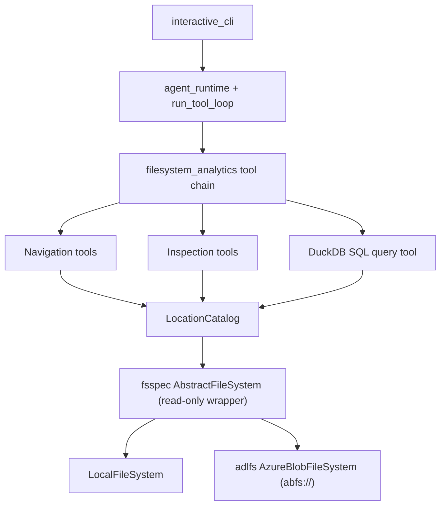

# Filesystem Analytics Agent (Phase 1)

## Goal

Turn the existing tool-loop template into an analytics agent that operates over file systems — local (Linux/Windows/on-prem) and ADLS Gen2 in Phase 1 — with a backend-agnostic storage layer so S3 and other backends become config-only additions later. Read-only throughout Phase 1.

## Architecture

The agent runtime, tool loop, provider layer, and `ToolDefinition`/`ToolRegistry` machinery stay as-is. We add a storage abstraction and one new tool chain, and retire two old chains.

## 1. Storage abstraction layer — new package `analytics_agent/filesystem/`

- `locations.py`: `DataLocation` value object (name, URI, backend kind) and `LocationCatalog` that resolves agent-facing paths like `sales/2024/*.parquet` within a named location. All tool access goes through the catalog — no raw path escape outside configured roots (normalize and reject `..` traversal).
- `backends.py`: factory that builds an fsspec filesystem per location — `LocalFileSystem` for `file://`, `adlfs.AzureBlobFileSystem` for `abfs://`. ADLS auth in priority order: explicit account key (`AZURE_STORAGE_ACCOUNT_KEY`), SAS token (`AZURE_STORAGE_SAS_TOKEN`), otherwise `DefaultAzureCredential` from `azure-identity` (covers az CLI login, service principal env vars, managed identity).
- Read-only enforcement: a thin wrapper exposing only read operations (`ls`, `info`, `open("rb")`, `glob`, `exists`) so a bug in a tool can never write or delete. This is the Phase 1 safety boundary.
- Config: named locations defined in a `locations.toml` at the project root (path overridable via `ANALYTICS_AGENT_LOCATIONS` env var). When absent, fall back to a single `local` location rooted at a `--data-path`/default directory so the quickstart works with zero config. Credentials never live in the file — only env var references.

## 2. New tool chain — `analytics_agent/tools/filesystem_analytics/`

Follows the existing pattern: `build_filesystem_definitions(catalog) -> list[ToolDefinition]`, Pydantic input models with `extra="forbid"`, string outputs, hard row/byte caps. Essential tools:

- Navigation: `list_locations` (configured roots + backend kind), `list_directory` (entries with size/type, glob support, capped), `get_file_info` (size, modified, format detection by extension).
- Inspection: `inspect_schema` (columns/types for CSV and Parquet via DuckDB/pyarrow, works over any backend), `preview_data` (first N rows of tabular files, capped at 20), `read_text_file` (bounded byte-range read for txt/log/json files).
- Query: `query_data` — SQL over one or more files/globs via DuckDB. Registers the fsspec filesystem with DuckDB (`conn.register_filesystem`) so `read_parquet('abfs://...')` works through the same authenticated, read-only layer. Reuse the sql_analyzer's proven guardrails: single-statement `SELECT` only, row cap of 50, `enable_external_access` disabled after registration.

Formats in Phase 1: txt, CSV, Parquet. Delta Lake and Iceberg are Phase 2 (via `deltalake` and `pyiceberg` feeding Arrow into the same DuckDB query path) — the schema/preview/query tools are designed so a format handler is the only addition needed.

## 3. Retire superseded chains

- Delete `tools/dataframe/` and `tools/sql_analyzer/` packages, their tests, `dataframe_main.py`, and the `dataframe_agent` entry point (migrate the SQL validation helpers into the new query tool first).
- Keep `incident_response` as the demo chain and the `agent` interactive entry point; remove `incident_agent`'s sibling or keep as-is (keep).
- Register `ToolChain.filesystem_analytics` in `_TOOL_CHAIN_BUILDERS`, `available_tool_chains()`, and default prompts in [analytics_agent/tools/tool_chains.py](analytics_agent/tools/tool_chains.py).

## 4. Dependencies

Add: `fsspec`, `adlfs`, `azure-identity`. Remove nothing else (duckdb, pyarrow, pandas already present). `matplotlib`/`polars` become removable once sql_analyzer is gone — drop them if nothing else uses them.

## 5. Testing

- Unit tests run fully offline: tools tested against `LocalFileSystem` on temp dirs and fsspec's `MemoryFileSystem` standing in as the "remote" backend, proving backend-agnosticism without Azure.
- ADLS backend factory tested with mocks (auth priority order, URI parsing); no live Azure calls in CI.
- Read-only wrapper gets explicit tests that write/delete operations are unavailable.
- Path-traversal rejection tests on `LocationCatalog`.

## 6. Documentation

Update README per the maintenance rule: new value proposition (analytics agent over local + ADLS Gen2 file systems), quickstart with `locations.toml` example and Azure auth options, tool reference, architecture section replacing dataframe/sql_analyzer, safety section (read-only enforcement, SELECT-only SQL, caps), and Phase 2 items (Delta, Iceberg, S3) labeled as future work.

## Phase 2+ (documented, not built now)

Delta Lake + Iceberg readers, S3 backend, dataset profiling tools (null counts, distributions), partitioned-dataset awareness, scratch-location writes for saving results.